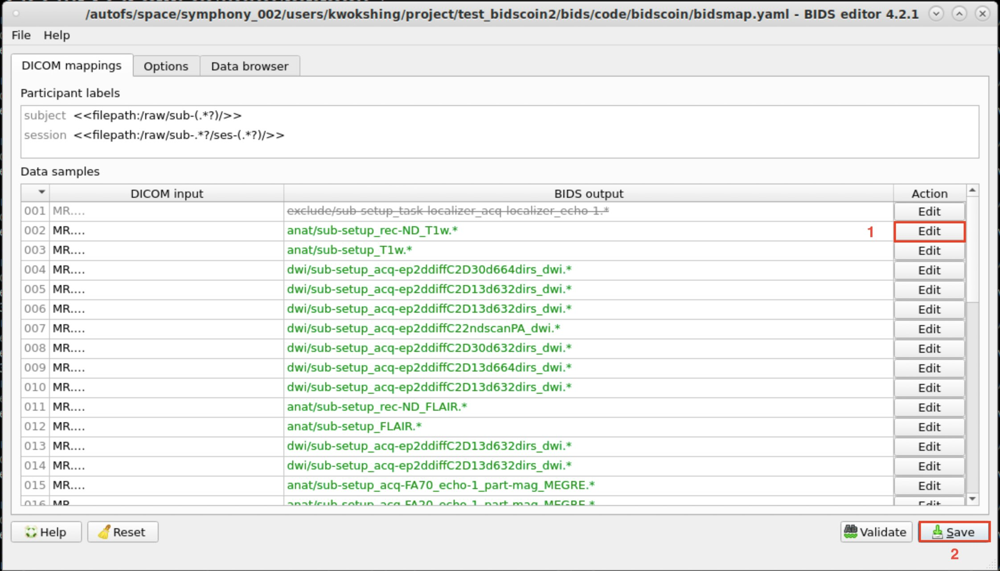
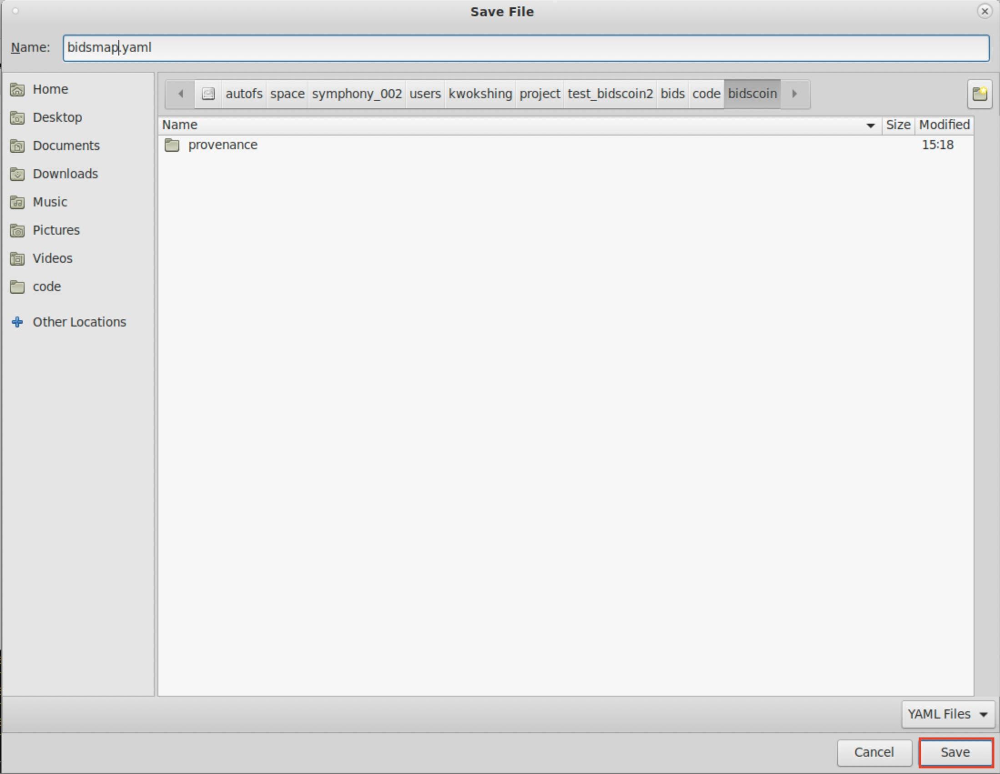

# howto_connecto/howto_bids

This repository contains the shell scripts that allow using bidscoin for the Martinos Center data structure

## Dependence

- BIDscoin >= v4.2.1 (<https://github.com/Donders-Institute/bidscoin>)

## Prerequisite

We need to setup a conda environment and install bidscoin before we can use it. I already did it for our group so you may skip this section. Here I just put everything I did for the record.

We need to install Miniforge first. For the instruction please see <https://it.martinos.org/help/python/>.

Once we install Miniforge, we can create a new environment for bidscoin. This was done:

```bash
source /autofs/space/linen_001/users/kwokshing/tools/connecto_survivalkit/howto_process/howto_bids/initiate_conda.sh 
conda create -n bidscoin_env python=3.9 pip
```

Then activate the virtual envionment

```bash
source activate bidscoin_env
```

Once the virtual envionment is activated, we can use pip to install bidscoin:

```bash
pip install bidscoin[all] 
```

For the time being the default version is 4.2.1. By default it will download Qt6.6.x but we miss some of the libraries required for Qt6.5.x onwards. Therefore, we need to uninstall Qt and reinstall a backward version (6.4.2):

```bash
pip uninstall pyQt6 PyQt6-Qt6 PyQt6-sip
```

and then

```bash
pip install PyQt6==6.4.2 PyQt6-Qt6==6.4.2
```

This should solve the issue with Qt6. We can test the installation by running

```bash
bidscoin -t 
```

There should be no warning.

## Section 1: Mapping study-specific DICOM data to BIDs

For a new project, we need to create a file to map the DICOM data to the BIDS we want to have.

Before we start, we should have the following:

- ScanID of 1 subject. The ScanID is the name we used to register the subject in the console. ('Tract_C2_HC016' in this example)
- Project directory. This is the directory you want the BIDS data to be store. ('/your/project/folder/' in this example)

### Step 1

The easiest way is to copy one full set of DICOM data from Bourget to the local storage. If some subjects were scanned with (slightly) different acquisitions, then we should copy them to local storage for the mapping too. This could be done by, for example,

```bash
sh /autofs/space/linen_001/users/kwokshing/tools/connecto_survivalkit/howto_process/howto_bids/copy_to_local.sh -i Tract_C2_HC_016 -o /your/project/folder/raw/sub-016
```

This script will perform three tasks:

1. find the DICOMs from the network and copy them to local storage
2. add .dcm extension to all DICOM files so that BIDscoin can recognise the files
3. Reorganise the directory using `dicomsort` tool

You should repeat the above operation if, for example, Tract_C2_HC_017 was scanned with different sequences.

After the operation, you should be able to see the DICOM directories are created in `/your/project/folder/raw/` and sorted.

### Step 2

Then we need to create a bids folder where the data will be stored

```bash
mkdir /your/project/folder/bids/
```

### Step 3

We can then perform the actual mapping. First, we need to initiate conda environment to be able to use bidscoin. I already set up the environment and installed bidscoin for our group. We can simply run:

```bash
source /autofs/space/linen_001/users/kwokshing/tools/connecto_survivalkit/howto_process/howto_bids/initiate_conda.sh 
source activate bidscoin_env
```

Then run bidsmapper using the template I set up for TractCaliber for example.

```bash
bidsmapper /your/project/folder/raw/ /your/project/folder/bids/ -t  /autofs/space/linen_001/users/kwokshing/tools/connecto_survivalkit/howto_process/howto_bids/tractcaliber_template.yaml -s 
```

(Optional) We can start from the default template and manually update the bids naming structure as we prefer:

```bash
bidsmapper /your/project/folder/raw/ /your/project/folder/bids/ -s 
```

`bidsmapper` will automatically detect the DICOM files and sort them based on acquisitions. At the end of the command, a GUI will pop up:



1. We can manually update the naming structure based on our needs here.

2. Once we satisfy the structure of all acquisitions. We can save the mapping file and then exit by closing the window.

It would be wise to check all the sequences to see if everything is sorted correctly.



Now the mapping is completed. We can clean up the raw/ folder

rm -r /your/project/folder/raw/*

Generally speaking we only need to perform the mapping step once. If there are some new data acquired using other sequences, we need to re-run `bidsmapper` to map all data again.

Extra information: <https://bidscoin.readthedocs.io/en/stable/index.html>

## Section 2: Converting DICOM data to BIDs

Once we create the mapping file, we can convert DICOM to BIDS on individual subjects:

```bash
sh /autofs/space/linen_001/users/kwokshing/tools/connecto_survivalkit/howto_process/howto_bids/dicom2bids.sh -i Tract_C2_HC_016 -o sub-016 -d /your/project/folder/
```

Here, `-i` is the input of the scan ID used as the subject name when we register the subject in the console; `-o` is the subject label used in the project; and `-d` is the directory to the project folder.
