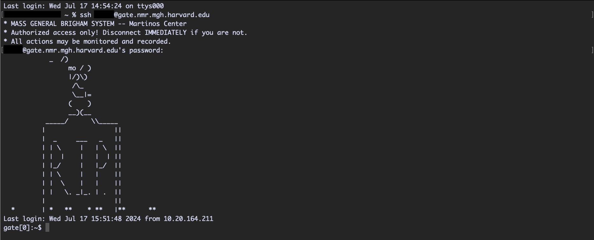
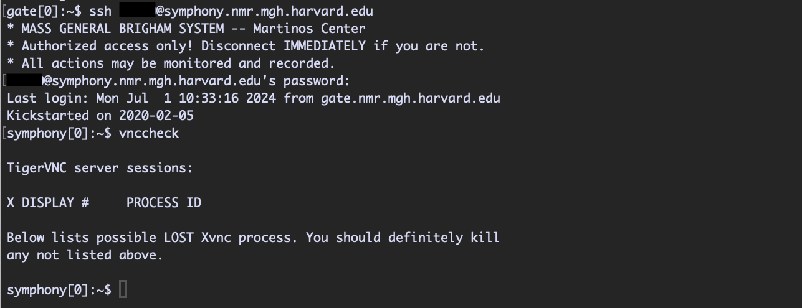
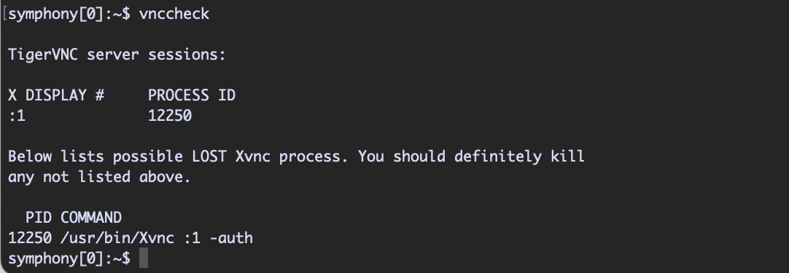
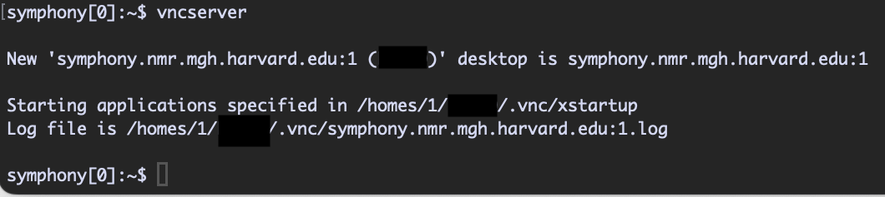
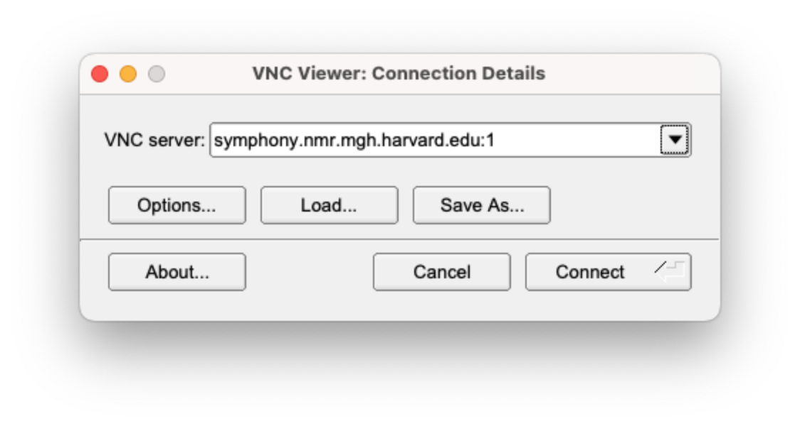
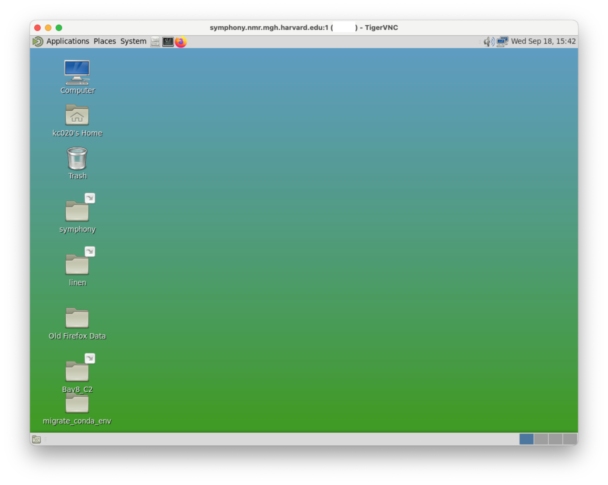

# howto_connecto/howto_vncsession

This document is for people who do not want to use NoMachine to access the server graphic remotely

## Related document

- https://www.nmr.mgh.harvard.edu/martinos/userInfo/computer/remoteAccess.php

## Software:

- Any VNC viewer (e.g., https://tigervnc.org)

## Step 1: Create an ssh tunnel to the Martinos Center coomputer system

On Mac terminal, you can use 

``ssh [username]@gate.nmr.mgh.harvard.edu``

Replace [username] with your user name. After entering your password, you should see the following message:

## Step 2: Create a second ssh tunnel to one of the servers available in our group

The current servers available are:
- symphony
- linen
- rhapsody
- allegro
- scheherazade

``ssh [username]@[server].nmr.mgh.harvard.edu``

Replace [server] with server name that you wanted to start the VNC session.

## Step 3: Create a VNC password

Once you are in, you need to create a new password for your VNC sessions (only the first time). You can do this by running:

``mkdir -p ~/.vnc``

and then 

``/usr/pubsw/bin/vncpasswd``

which will prompt you to setup a new passsword. This password can be different from your MGB password.

## Step 4: Check existing VNC session

Before starting a new VNC session, it is a good idea to always check if there is any existing running session. You can do this by running

``vnccheck``

If there is no existing session you should see something like this:

otherwise you will see the session(s) available to you here

## Step 5: Start a new VNC session

You can start a new VNC session using the vncserver command:

``vncserver``

Here you can see a new session is created. Take note of the port number (i.e., ':1' here).

## Step 6: Access the VNC session using VNC viewer

Start your VNC viewer software and enter the server address. 

You will be prompt to enter the password which is the one you just created for VNC.

You should be able to see the desktop GUI once you are in.

**If you lost your VNC session connection, always check if you can make a ssh connection to the server first. This will indicate if the server is currently available (online). After this you should check if there is any running VNC session. Generally, all VNC sessions are killed after rebooting the server (e.g. power outage) so you need to use vncserver to start a new seesion.**